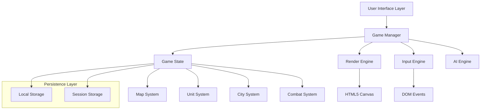

# Design Document: Warlords Clone

## Overview

Warlords Clone - это современная веб-версия классической пошаговой стратегии, реализованная с использованием HTML5, CSS3 и JavaScript. Игра сохраняет оригинальный геймплей с улучшенной графикой и современным пользовательским интерфейсом.

Архитектура основана на модульном подходе с четким разделением ответственности между компонентами. Игра использует HTML5 Canvas для рендеринга, современные JavaScript паттерны для управления состоянием и CSS Grid/Flexbox для адаптивного интерфейса.

## Architecture

### High-Level Architecture



### Technology Stack

- **Frontend**: HTML5, CSS3, JavaScript (ES6+)
- **Graphics**: HTML5 Canvas API
- **State Management**: Custom state management with Observer pattern
- **Storage**: Browser Local Storage для сохранений
- **Build Tools**: Vanilla JavaScript (без фреймворков для простоты)
- **Testing**: Jest для unit тестов, custom property-based testing

### Design Patterns

1. **Model-View-Controller (MVC)**: Разделение игровой логики, представления и управления
2. **Observer Pattern**: Для уведомлений об изменениях состояния
3. **Command Pattern**: Для обработки пользовательских действий и undo/redo
4. **State Pattern**: Для управления различными состояниями игры
5. **Factory Pattern**: Для создания юнитов и игровых объектов

## Components and Interfaces

### Core Components

#### GameManager
Центральный контроллер игры, координирующий все системы.

```javascript
class GameManager {
    constructor() {
        this.gameState = new GameState();
        this.renderEngine = new RenderEngine();
        this.inputEngine = new InputEngine();
        this.aiEngine = new AIEngine();
        this.currentPlayer = 0;
        this.gamePhase = 'SETUP'; // SETUP, PLAYING, ENDED
    }
    
    // Основные методы
    initializeGame(config) { /* ... */ }
    startTurn(playerId) { /* ... */ }
    endTurn() { /* ... */ }
    processAction(action) { /* ... */ }
    checkVictoryConditions() { /* ... */ }
}
```

#### GameState
Хранит полное состояние игры.

```javascript
class GameState {
    constructor() {
        this.map = new Map();
        this.players = [];
        this.units = new Map();
        this.cities = new Map();
        this.currentTurn = 1;
        this.activePlayer = 0;
        this.observers = [];
    }
    
    // State management methods
    subscribe(observer) { /* ... */ }
    notify(event) { /* ... */ }
    serialize() { /* ... */ }
    deserialize(data) { /* ... */ }
}
```

#### RenderEngine
Отвечает за отрисовку всех игровых элементов.

```javascript
class RenderEngine {
    constructor(canvasId) {
        this.canvas = document.getElementById(canvasId);
        this.ctx = this.canvas.getContext('2d');
        this.camera = new Camera();
        this.sprites = new SpriteManager();
    }
    
    // Rendering methods
    render(gameState) { /* ... */ }
    renderMap(map) { /* ... */ }
    renderUnits(units) { /* ... */ }
    renderUI(gameState) { /* ... */ }
}
```

#### InputEngine
Обрабатывает пользовательский ввод.

```javascript
class InputEngine {
    constructor(gameManager) {
        this.gameManager = gameManager;
        this.selectedUnit = null;
        this.hoveredHex = null;
        this.setupEventListeners();
    }
    
    // Input handling methods
    handleClick(event) { /* ... */ }
    handleMouseMove(event) { /* ... */ }
    handleKeyPress(event) { /* ... */ }
    screenToHex(x, y) { /* ... */ }
}
```

### Game Systems

#### Map System
Управляет игровой картой и местностью.

```javascript
class Map {
    constructor(width, height) {
        this.width = width;
        this.height = height;
        this.hexes = new Array(width * height);
        this.initializeTerrain();
    }
    
    getHex(x, y) { /* ... */ }
    getNeighbors(x, y) { /* ... */ }
    calculateMovementCost(from, to, unit) { /* ... */ }
    findPath(start, end, unit) { /* ... */ }
}

class Hex {
    constructor(x, y, terrain) {
        this.x = x;
        this.y = y;
        this.terrain = terrain; // PLAINS, FOREST, MOUNTAIN, WATER, ROAD
        this.unit = null;
        this.city = null;
        this.movementCost = this.getMovementCost();
    }
}
```

#### Unit System
Управляет всеми игровыми юнитами.

```javascript
class Unit {
    constructor(type, owner, x, y) {
        this.id = generateId();
        this.type = type; // WARRIOR, ARCHER, CAVALRY, HERO
        this.owner = owner;
        this.x = x;
        this.y = y;
        this.health = this.getMaxHealth();
        this.movement = this.getMaxMovement();
        this.attack = this.getAttackValue();
        this.defense = this.getDefenseValue();
        this.hasActed = false;
    }
    
    move(newX, newY) { /* ... */ }
    attack(target) { /* ... */ }
    canMoveTo(x, y, map) { /* ... */ }
}

class Hero extends Unit {
    constructor(name, owner, x, y) {
        super('HERO', owner, x, y);
        this.name = name;
        this.level = 1;
        this.experience = 0;
        this.items = [];
        this.spells = [];
    }
    
    gainExperience(amount) { /* ... */ }
    levelUp() { /* ... */ }
    equipItem(item) { /* ... */ }
    castSpell(spell, target) { /* ... */ }
}
```

#### City System
Управляет городами и производством.

```javascript
class City {
    constructor(name, owner, x, y, size = 1) {
        this.id = generateId();
        this.name = name;
        this.owner = owner;
        this.x = x;
        this.y = y;
        this.size = size;
        this.production = [];
        this.garrison = [];
    }
    
    produceUnit(unitType) { /* ... */ }
    canProduce(unitType) { /* ... */ }
    getProductionCost(unitType) { /* ... */ }
    changeOwner(newOwner) { /* ... */ }
}
```

#### Combat System
Обрабатывает сражения между юнитами.

```javascript
class CombatSystem {
    static resolveCombat(attacker, defender, terrain) {
        const attackRoll = this.rollDice() + attacker.attack;
        const defenseRoll = this.rollDice() + defender.defense + terrain.defenseBonus;
        
        if (attackRoll > defenseRoll) {
            const damage = attackRoll - defenseRoll;
            defender.health -= damage;
            
            if (defender.health <= 0) {
                return { winner: attacker, loser: defender, damage };
            }
        }
        
        return { winner: null, damage: Math.max(0, attackRoll - defenseRoll) };
    }
    
    static rollDice() {
        return Math.floor(Math.random() * 6) + 1;
    }
}
```

## Data Models

### Game Configuration
```javascript
const GameConfig = {
    map: {
        width: 20,
        height: 15,
        hexSize: 32
    },
    players: [
        { id: 0, name: 'Player 1', faction: 'HUMANS', color: '#0066CC', isAI: false },
        { id: 1, name: 'AI 1', faction: 'ELVES', color: '#00CC66', isAI: true },
        { id: 2, name: 'AI 2', faction: 'DEMONS', color: '#CC0066', isAI: true }
    ],
    units: {
        WARRIOR: { health: 10, attack: 3, defense: 2, movement: 2, cost: 50 },
        ARCHER: { health: 8, attack: 4, defense: 1, movement: 2, cost: 60 },
        CAVALRY: { health: 12, attack: 5, defense: 2, movement: 4, cost: 80 },
        HERO: { health: 20, attack: 6, defense: 4, movement: 3, cost: 0 }
    },
    terrain: {
        PLAINS: { movementCost: 1, defenseBonus: 0 },
        FOREST: { movementCost: 2, defenseBonus: 1 },
        MOUNTAIN: { movementCost: 3, defenseBonus: 2 },
        WATER: { movementCost: 999, defenseBonus: 0 },
        ROAD: { movementCost: 0.5, defenseBonus: 0 }
    }
};
```

### Save Game Format
```javascript
const SaveGameFormat = {
    version: '1.0',
    timestamp: Date.now(),
    gameState: {
        currentTurn: 1,
        activePlayer: 0,
        gamePhase: 'PLAYING',
        map: {
            width: 20,
            height: 15,
            hexes: [/* serialized hex data */]
        },
        players: [/* player data */],
        units: [/* unit data */],
        cities: [/* city data */]
    }
};
```

## Correctness Properties

*A property is a characteristic or behavior that should hold true across all valid executions of a system—essentially, a formal statement about what the system should do. Properties serve as the bridge between human-readable specifications and machine-verifiable correctness guarantees.*

### Property 1: Game Initialization Consistency
*For any* selected faction and game configuration, initializing a new game should create a valid game state with the correct starting cities, units, and map for that faction.
**Validates: Requirements 1.3, 1.5**

### Property 2: Movement Cost Calculation
*For any* unit and terrain combination, movement cost calculation should be deterministic and based on the unit's characteristics and terrain properties.
**Validates: Requirements 2.3**

### Property 3: Terrain Impassability Rules
*For any* unit without special abilities, attempting to move into impassable terrain should be prevented by the game engine.
**Validates: Requirements 2.5**

### Property 4: Unit Selection and Movement
*For any* player's turn and any of their units, selecting the unit should highlight valid movement destinations, and movement should only be allowed to valid destinations.
**Validates: Requirements 3.1, 3.2**

### Property 5: Stack Movement Consistency
*For any* stack of units, when the stack moves, all units in the stack should move together to the same destination.
**Validates: Requirements 3.3**

### Property 6: Movement Point Constraints
*For any* unit that has exhausted its movement points, further movement attempts should be prevented until the next turn.
**Validates: Requirements 3.4**

### Property 7: Combat Initiation
*For any* case where enemy units meet on the same hex, combat should be automatically initiated.
**Validates: Requirements 3.5, 6.1**

### Property 8: Hero Experience and Leveling
*For any* hero participating in combat, experience should be awarded based on battle outcome, and when experience reaches the threshold, the hero should level up with increased stats.
**Validates: Requirements 4.1, 4.2**

### Property 9: Item Effect Application
*For any* hero carrying items, the item bonuses should be correctly applied to the hero's capabilities and reflected in combat calculations.
**Validates: Requirements 4.4**

### Property 10: City Production Rules
*For any* city controlled by a player, unit production should be limited by the city's faction, available resources, and city size constraints.
**Validates: Requirements 5.1, 5.2, 5.5**

### Property 11: City Ownership Transfer
*For any* city that is captured in combat, ownership should immediately transfer to the conquering player with all associated benefits and responsibilities.
**Validates: Requirements 5.3**

### Property 12: Combat Resolution Correctness
*For any* combat encounter, the resolution should consider all relevant factors (unit types, terrain bonuses, hero leadership, random factors) and produce consistent results with appropriate damage calculation.
**Validates: Requirements 6.2, 6.3, 6.4**

### Property 13: Turn-Based Game Flow
*For any* game turn, players should have access to all their actions during their turn, and when they end their turn, the game should progress to the next player or start a new round if all players have completed their turns.
**Validates: Requirements 7.1, 7.2, 7.3**

### Property 14: Victory Condition Detection
*For any* game state where victory conditions are met (all enemy cities captured or all enemy forces eliminated), the game should detect this and declare the appropriate winner.
**Validates: Requirements 8.1, 8.2, 8.3**

### Property 15: User Interface Information Display
*For any* selected game object (unit, city, terrain), relevant information should be displayed to the player, and the current game state (turn, resources, status) should always be clearly visible.
**Validates: Requirements 9.2, 9.5**

### Property 16: Save/Load State Consistency
*For any* game state, saving and then loading should restore the exact same game state with all units, cities, turn information, and player data intact.
**Validates: Requirements 10.1, 10.2, 10.3**

## Error Handling

### Input Validation
- All user inputs (clicks, keyboard commands) должны быть валидированы перед обработкой
- Недопустимые действия должны быть заблокированы с соответствующим уведомлением пользователя
- Координаты должны проверяться на границы карты

### State Consistency
- Состояние игры должно проверяться на консистентность после каждого действия
- Недопустимые состояния должны быть предотвращены или исправлены
- Критические ошибки должны логироваться для отладки

### Storage Errors
- Ошибки сохранения/загрузки должны обрабатываться gracefully
- Пользователь должен получать понятные сообщения об ошибках
- Должны быть предусмотрены fallback механизмы для восстановления

### Network and Performance
- Таймауты для длительных операций (ИИ ходы)
- Обработка ошибок рендеринга Canvas
- Graceful degradation для слабых устройств

## Testing Strategy

### Dual Testing Approach
Тестирование будет включать как unit тесты, так и property-based тесты для обеспечения комплексного покрытия:

- **Unit тесты**: Проверяют конкретные примеры, граничные случаи и условия ошибок
- **Property тесты**: Проверяют универсальные свойства на множестве входных данных
- Оба типа тестов дополняют друг друга и необходимы для полного покрытия

### Property-Based Testing Configuration
- **Библиотека**: fast-check для JavaScript property-based testing
- **Минимум итераций**: 100 итераций на каждый property тест
- **Тегирование**: Каждый тест должен ссылаться на соответствующее свойство дизайна
- **Формат тега**: **Feature: warlords-clone, Property {number}: {property_text}**

### Unit Testing Focus
Unit тесты должны сосредоточиться на:
- Конкретных примерах, демонстрирующих корректное поведение
- Граничных случаях (пустые входы, максимальные значения)
- Условиях ошибок и их обработке
- Интеграционных точках между компонентами

### Test Coverage Areas
1. **Game State Management**: Сериализация, десериализация, консистентность состояния
2. **Combat System**: Расчеты урона, применение бонусов, результаты сражений
3. **Movement System**: Расчет стоимости движения, валидация путей, ограничения
4. **AI Behavior**: Принятие решений ИИ, валидность ходов
5. **UI Interactions**: Обработка кликов, отображение информации, обновления интерфейса
6. **Save/Load System**: Целостность данных, обработка ошибок

### Performance Testing
- Тестирование производительности рендеринга больших карт
- Проверка времени отклика ИИ
- Тестирование памяти при длительных играх
- Проверка работы на мобильных устройствах