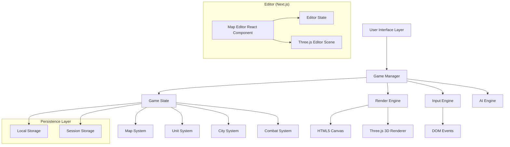

# Системные Паттерны

## Архитектура

### Высокоуровневая Диаграмма



### Двухпроектная Архитектура

Проект состоит из двух частей:
1. **Основной проект** (Vanilla JS) - игровая логика и основной интерфейс
2. **Редактор карт** (Next.js 16 + React 19) - современный редактор карт

Оба проекта используют общие классы игровой логики (`Map`, `Hex`) через TypeScript версии в `editor-nextjs/lib/game/`.

## Ключевые Технические Решения

### Паттерн 1: Model-View-Controller (MVC)

**Описание**: Разделение игровой логики, представления и управления

**Как использовать**:
- **Model**: `GameState`, `Map`, `Hex`, `City`, `Unit` - чистые классы данных без UI зависимостей
- **View**: `RenderEngine`, `RenderEngine3D`, `CityRenderer` - отвечают только за отрисовку
- **Controller**: `GameManager`, `InputEngine` - обрабатывают пользовательский ввод и координируют модели и представления

**Пример**:
```javascript
// Model (GameState.js)
class GameState {
    constructor() {
        this.map = new Map();
        this.observers = [];
    }
    notify(event) { /* ... */ }
}

// View (RenderEngine.js)
class RenderEngine {
    render(gameState) { /* отрисовка на основе состояния */ }
}

// Controller (GameManager.js)
class GameManager {
    constructor() {
        this.gameState = new GameState();
        this.renderEngine = new RenderEngine();
    }
    processAction(action) {
        // Изменяем модель
        this.gameState.update(action);
        // Обновляем представление
        this.renderEngine.render(this.gameState);
    }
}
```

### Паттерн 2: Observer Pattern

**Описание**: Для уведомлений об изменениях состояния игры

**Как использовать**: Все компоненты подписываются на `GameState` и получают уведомления о изменениях

**Пример**:
```javascript
gameState.subscribe((event) => {
    if (event.type === 'UNIT_MOVED') {
        renderEngine.updateUnitPosition(event.data);
    }
});
```

### Паттерн 3: Factory Pattern

**Описание**: Для создания юнитов, героев и игровых объектов

**Как использовать**: Используется в `Unit`, `Hero`, `City` классах для создания стандартизированных объектов

### Паттерн 4: Command Pattern

**Описание**: Для обработки пользовательских действий с возможностью undo/redo

**Реализация**: Каждое действие игрока инкапсулируется в команду

### Паттерн 5: State Pattern

**Описание**: Для управления различными состояниями игры (SETUP, PLAYING, ENDED)

**Реализация**: `GameManager.gamePhase` определяет доступные действия

## Стандарты Кода

### Именование

- **Классы**: PascalCase (`GameManager`, `RenderEngine`)
- **Методы/функции**: camelCase (`initializeGame`, `processAction`)
- **Константы**: UPPER_SNAKE_CASE (`MAX_UNITS`, `TERRAIN_TYPES`)
- **Приватные поля**: начинаются с `_` (`_loadModelInternal`, `_models`)
- **Файлы**: PascalCase для классов (`GameState.js`), camelCase для утилит (`mapGenerator.js`)

### Структура файлов

```
warlords-clone/
├── index.html              # Точка входа для основной игры
├── map-editor.html         # Точка входа для редактора карт (Vanilla JS)
├── js/
│   ├── main.js            # Инициализация игры
│   ├── core/              # Ядро игровой логики (Vanilla JS)
│   │   ├── GameManager.js
│   │   ├── GameState.js
│   │   ├── Map.js
│   │   ├── Hex.js
│   │   ├── Unit.js
│   │   └── ...
│   ├── editor/            # Редактор карт (Vanilla JS версия)
│   │   └── MapEditor.js
│   └── ui/                # UI компоненты (Vanilla JS)
│       └── GameSetup.js
├── editor-nextjs/         # Редактор карт (Next.js)
│   ├── app/               # Next.js App Router
│   ├── components/        # React компоненты
│   └── lib/
│       └── game/          # TypeScript версии игровых классов
├── assets/                # 3D модели и текстуры
└── styles/                # CSS файлы (Shadcn/ui темы)
```

### Обработка ошибок

**Принцип**: Fail gracefully с fallback значениями

**Пример**:
```javascript
async loadModel(key, objPath, mtlPath) {
    try {
        return await this._loadModelInternal(key, objPath, mtlPath);
    } catch (error) {
        console.error(`Failed to load model ${key}:`, error);
        // Возвращаем fallback геометрию вместо остановки игры
        return this.createFallbackMesh();
    }
}
```

**Логирование**:
- Используем `console.error` для критических ошибок
- Используем `console.warn` для предупреждений (например, медленная загрузка)
- Используем `console.log` для информационных сообщений (загрузка моделей)

### Асинхронные операции

**Паттерн**: Используем `Promise.race` с таймаутами для предотвращения зависаний

**Пример**:
```javascript
const timeoutPromise = new Promise((_, reject) =>
    setTimeout(() => reject(new Error('Timeout')), 5000)
);
const model = await Promise.race([loadPromise, timeoutPromise]);
```

## Архитектурные Правила

### 1. Разделение ответственности

- **Игровая логика** (`core/`) не должна зависеть от UI или рендеринга
- **Рендереры** (`RenderEngine`, `RenderEngine3D`) не должны содержать игровую логику
- **UI компоненты** (`ui/`) не должны напрямую модифицировать игровое состояние

### 2. Использование Three.js

- Все 3D операции через `RenderEngine3D` или `MapEditor`
- Модели кешируются в `ModelLoader` для повторного использования
- Текстуры управляются через `TextureManager`

### 3. Миграция на React

- Новый функционал для редактора карт разрабатывается в `editor-nextjs/`
- Общая игровая логика портируется в TypeScript в `editor-nextjs/lib/game/`
- Основной проект остается на Vanilla JS до завершения миграции

### 4. Стилизация

- Используем Shadcn/ui компоненты и темы (`styles/shadcn-*.css`)
- Темная тема по умолчанию (класс `dark` на `<html>`)
- Адаптивность через CSS Grid/Flexbox

### 5. Гибридная Архитектура React/Vanilla JS

**Принцип**: Разделение UI слоя и игровой логики

**Как работает**:
- **React (Next.js)**: Только для редактора карт и UI компонентов
- **Vanilla JS**: Вся игровая логика (GameManager, GameState, AI, Combat)
- **Связь**: React компоненты вызывают методы vanilla JS классов через refs/hooks
- **Canvas**: Остается вне React дерева, управление через refs

**Пример интеграции**:
```typescript
// React компонент использует vanilla JS класс
const editor = useRef<MapEditor | null>(null);

useEffect(() => {
  editor.current = new MapEditor(canvasRef.current);
  // MapEditor - vanilla JS класс
}, []);
```

### 6. Shadcn/ui Компоненты

**В Vanilla JS**:
- Использование через CSS классы или JavaScript API
- Компоненты в `js/ui/shadcn.js`
- Темы в `styles/shadcn-theme.css` и `styles/shadcn-components.css`

**В Next.js**:
- Нативные React компоненты из `components/ui/`
- Полная поддержка TypeScript и Tailwind CSS
- Тема настроена в `app/globals.css`

### 7. Система Уровней Тайлов

**Описание**: Редактор карт поддерживает многоуровневую систему размещения тайлов (до 5 уровней, 0-4).

**Ключевые принципы**:
- **LEVEL_HEIGHT**: Константа, равная высоте базового тайла после масштабирования. Устанавливается один раз при первой загрузке тайла и используется для всех последующих вычислений
- **Позиционирование**: Каждый уровень размещается на верхней поверхности предыдущего уровня
- **Формула**: `Y_position = level * LEVEL_HEIGHT - minY`, где `minY` - нижняя точка модели после масштабирования
- **Уровень 0**: Нижняя часть тайла на уровне земли (Y = 0 - minY)
- **Уровень N**: Нижняя часть тайла на верхней поверхности уровня N-1 (Y = N * LEVEL_HEIGHT - minY)

**Структура данных**:
- `Map.hexes`: Массив стеков тайлов `(Hex[] | null)[]` - каждый элемент массива может содержать несколько тайлов на разных уровнях
- `Hex.height`: Число от 0 до 4, определяющее уровень тайла
- `selectedHex`: `{ x: number; y: number }` - всегда указывает на координаты, выбор верхнего тайла происходит автоматически через `map.getHex(x, y)`

**Как использовать**:
```typescript
// Получить верхний тайл в позиции
const topmostHex = map.getHex(x, y);

// Получить все тайлы в позиции (все уровни)
const hexStack = map.getHexStack(x, y);

// Получить тайл на конкретном уровне
const hexAtLevel = map.getHex(x, y, level);

// Разместить тайл на уровне
const hex = new Hex(x, y, terrain);
hex.height = targetLevel;
map.setHex(x, y, hex);
```

### 8. Синхронизация Выделения Тайлов

**Описание**: Рамка выделения (`selectionMeshRef`) должна синхронизироваться с позицией тайла при перемещении и изменении высоты.

**Проблема**: При асинхронном обновлении 3D мешей тайлов (`updateHexMesh`, `moveHex`, изменение высоты через R/F) выделение может отставать по вертикальной позиции, так как меш еще не создан или не обновлен в `hexMeshesRef`.

**Решение**: Использование двойного `requestAnimationFrame` для гарантии завершения рендеринга Three.js перед обновлением выделения:

```typescript
// После асинхронного обновления меша
await updateHexMesh(x, y, height);
requestAnimationFrame(() => {
  requestAnimationFrame(() => {
    setSelectedHex({ ...selectedHex }); // Триггерит useEffect для обновления выделения
  });
});
```

**В useEffect для выделения**:
```typescript
useEffect(() => {
  // ...
  // Всегда используем двойной requestAnimationFrame для гарантии синхронизации
  requestAnimationFrame(() => {
    requestAnimationFrame(updateHighlight);
  });
}, [selectedHex]);
```

**Применяется в**:
- `moveHex`: После перемещения тайла
- Изменение высоты (R/F): После изменения уровня тайла
- `updateHexMesh`: После обновления меша тайла (для кешированных моделей)

**Принцип**: Всегда ждать два кадра рендеринга перед обновлением выделения, чтобы убедиться, что Three.js полностью обновил позицию меша.

## Правила Разработки

### 1. Новый функционал

- **Редактор карт**: Разрабатывается в `editor-nextjs/` на React
- **Игровая логика**: Добавляется в `js/core/` на Vanilla JS
- **Общие классы**: Портируются в TypeScript в `editor-nextjs/lib/game/`

### 2. Тестирование

- **Unit тесты**: Jest для vanilla JS кода
- **Property тесты**: fast-check для проверки инвариантов
- **Тестовые файлы**: `js/__tests__/` для основного проекта
- Фокус на критических компонентах (GameState, Combat, AI)

### 3. Производительность

- **3D рендеринг**: Использовать viewport culling и LOD где возможно
- **Загрузка моделей**: Таймауты и fallback геометрия
- **UI обновления**: Минимизировать перерисовки (React.memo для React)
- **Game loop**: Не блокировать основной поток

